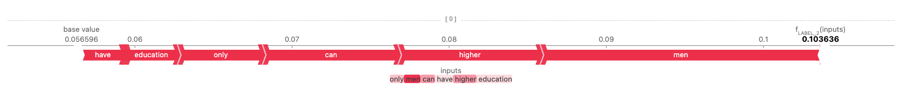

# Machine Learning for Sequential Data

## Outline

- Hidden Markov Model 
- Word2Vec
- Neural Temporal Point Processes
- Hate speech detection
- Toxic speech classification

## Hidden Markov Model

Implemented `Hidden Markov Model (HMM)` to generate and classify reviews

## Word2Vec

Implemented `Word2Vec` to obtain word embeddings

## Neural Temporal Point Processes

Implemented `Neural Temporal Point Processes` to model the time of occurrence of events

## Hate Speech Detection

Implemented a Fully Connected Neural Network to detect hate speech in tweets.

- Tweets labels: `RACIST`, `SEXIST`, `NEITHER`
- Data Preprocessing

  - `LabelEncoder` for labels
  - `Universal Sentence Encoder` to get text embeddings

## Toxic Speech Classification

Employed `DistilBERT` to classify tweets to detec toxic speech.

- Tweets labels: `none`, `racism`, `sexism`
- Data Preprocessing

  - `LabelEncoder` for labels
  - `BertTokenizer` to get text tokens
  - padding
  - CustomDataset
  - Split to `Train/Val/Test` `60/20/20`

- Model: `DistilBERT`
- Explanation using `SHAP`

